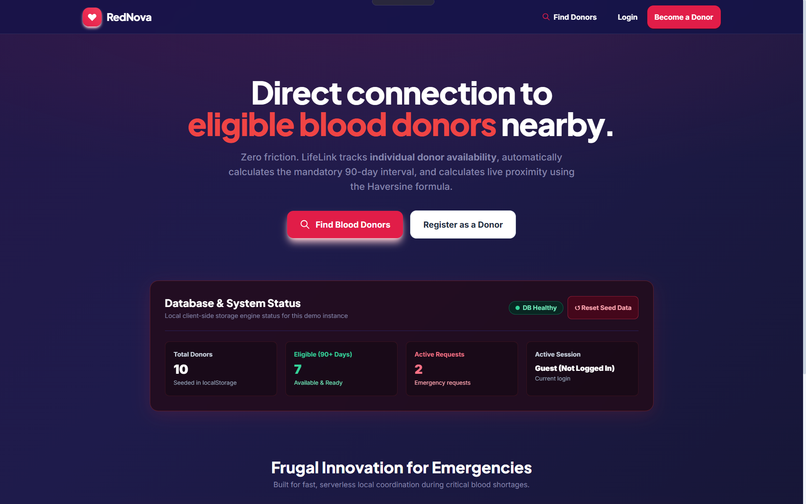
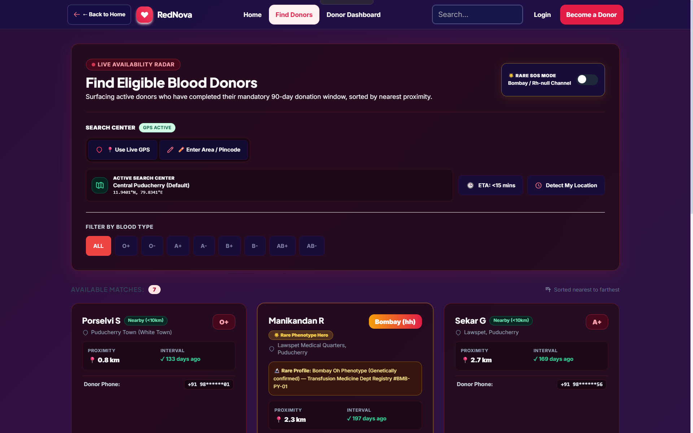
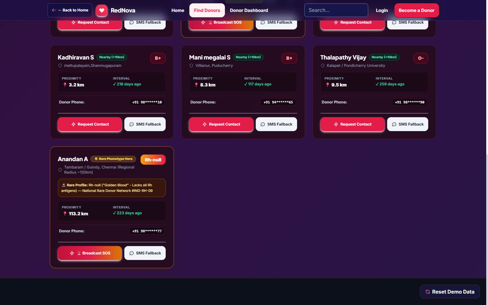
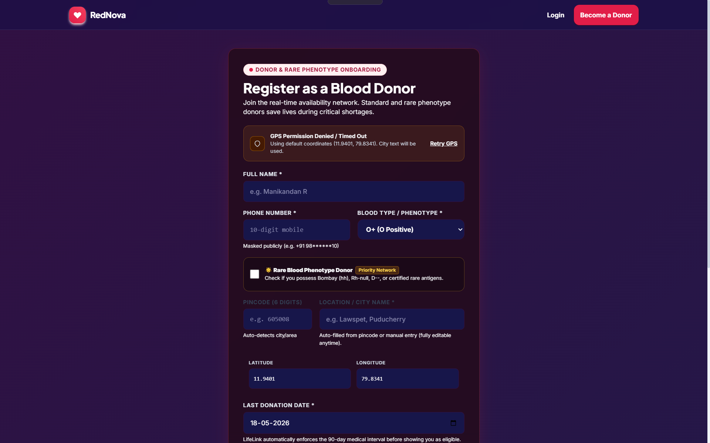
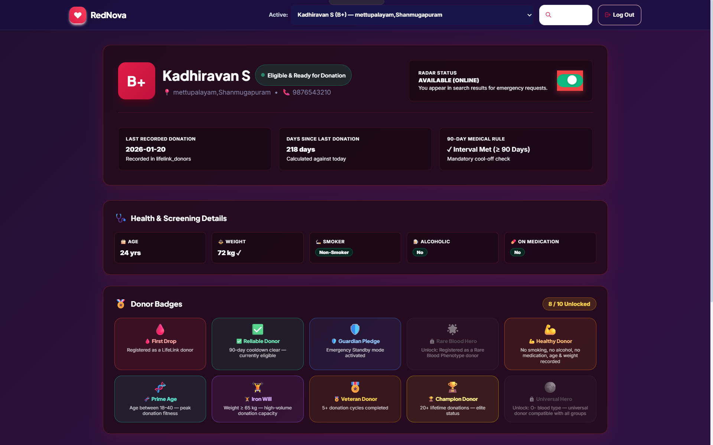

# 🩸 RedNova

### Hyperlocal Blood Donor Availability Network

RedNova is a lightweight web application that helps users **find eligible blood donors nearby** based on blood group, availability, eligibility, and location.

## ✨ Features

* 🩸 Blood group based donor search
* 📍 Nearby donor discovery
* ⏱️ 90-day donation eligibility check
* 🚨 Emergency blood requests
* 🧬 Rare blood donor support
* 👤 Donor registration & profiles
* 📩 Blood request & donor inbox
* 🔐 Privacy-focused phone masking
* 📱 Responsive design
* 🌐 Browser-based location detection
* 💾 Client-side LocalStorage database

## 🛠️ Tech Stack

* HTML5
* CSS3 / Tailwind CSS
* JavaScript (ES6)
* Browser Geolocation API
* LocalStorage

## 📂 Project Structure

```text
RedNova/
├── index.html
├── register.html
├── login.html
├── find.html
├── profile.html
├── css/
├── js/
├── tests/
└── vercel.json
```

## 🚀 Run Locally

```bash
git clone https://github.com/Kadhiravan1905/REDNOVA-Blood-Bank-Management-System.git
```

Open `index.html` or run it using **VS Code Live Server**.

## 🌐 Deployment

RedNova can be deployed on:

* Vercel
* GitHub Pages
* Netlify

## 📄 Documentation

Detailed project requirements and architecture:

`docs/RedNova_PRD.md`

---

### 🩸 RedNova

**Find the right donor, closer to you, when it matters most.**

## 📸 Screenshots

<p align="center">
  
</p>

<p align="center">
  
  
</p>

<p align="center">
  

</p>

<p align="center">
  
</p>
